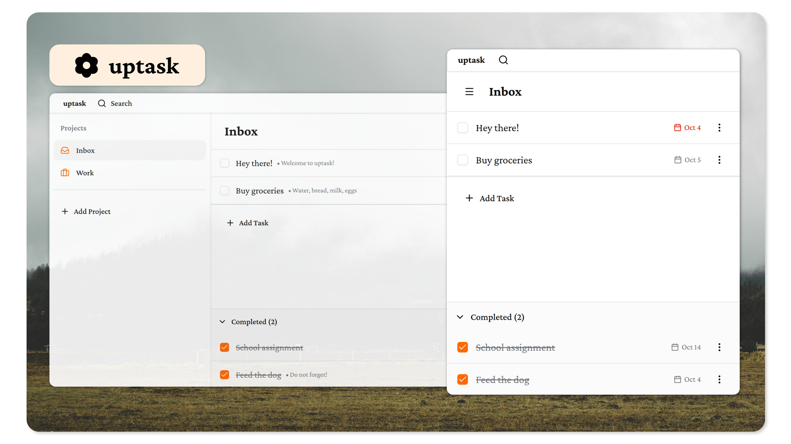

  

<h1 align="center">uptask</h1>

  <em>a calm and welcoming task manager. for the real work.</em>

  
  
  
  

---

## what is uptask?

uptask is a task manager built for people who value simplicity and focus. no bloat, no distractions—just clean project organization, real-time sync, and a beautiful interface that adapts to your workflow.

whether you're building something new or maintaining existing work, uptask keeps you organized without getting in your way.

## features

- ✨ **simple task tracking** — create, complete, and manage tasks with descriptions and due dates
- 📁 **project organization** — organize tasks into projects with custom icons
- ⚡ **real-time sync** — changes sync automatically across all your devices
- 🔒 **private by default** — row-level security ensures your data stays yours
- 🎨 **beautiful design** — modern, responsive UI with dark mode and customizable accent colors
- 🔐 **github authentication** — secure sign-in with your github account

## tech stack

uptask is built with modern, reliable technologies:

- **frontend** → React 19, TypeScript, Vite
- **styling** → Tailwind CSS 4, shadcn/ui components
- **backend** → Supabase (PostgreSQL + Auth + Real-time)
- **authentication** → Supabase Auth with GitHub OAuth
- **database** → PostgreSQL with Row Level Security (RLS)

## quick start

well, just go to [up-task.ru](https://up-task.ru) and start exploring!

for detailed self-host setup instructions, database configuration, and deployment guides, see [**docs/SETUP.md**](docs/SETUP.md).

## why uptask?

because task management shouldn't be complicated. we built uptask with a few principles in mind:

- **calm over chaos** — a peaceful interface that doesn't overwhelm
- **focus over features** — only what you need, nothing you don't
- **privacy over profit** — your data is yours, secured by design
- **simplicity over complexity** — straightforward workflows that just work

## screenshots

  

## contributing

contributions are welcome! whether it's bug fixes, new features, or documentation improvements, we'd love your help.

see [**docs/SETUP.md**](docs/SETUP.md) for development guidelines.

## license

MIT © [ehlvg](https://github.com/ehlvg)

  <strong>keep building ✨</strong>

